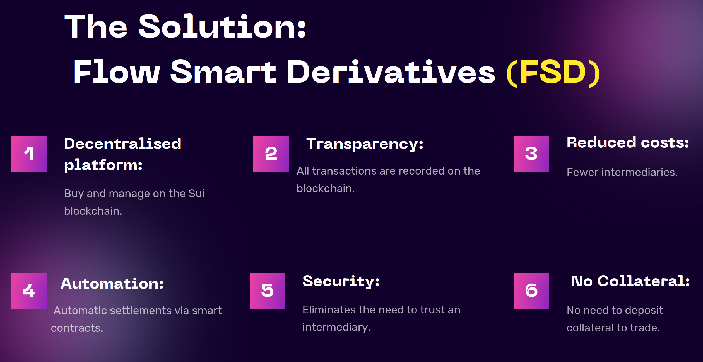
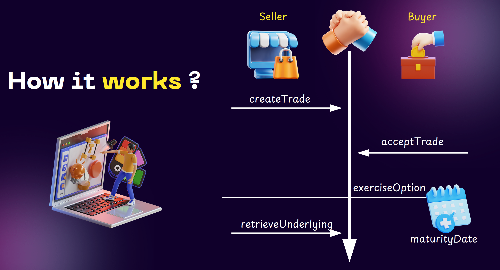
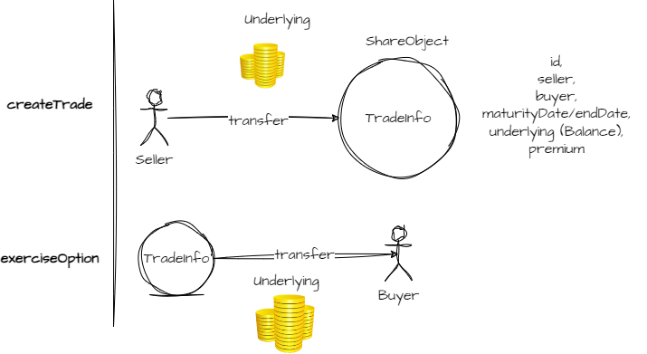
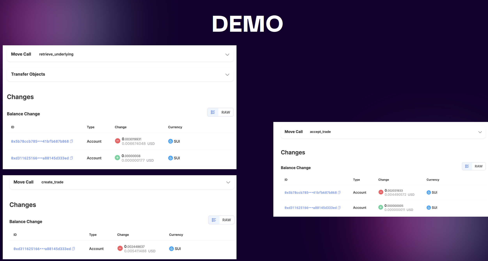

# SUI BSA Hackaton

> Project made during the 2024 SUI hackaton organized by the [BSA](https://bsaepfl.ch)
> Team:  [Arthur Y.](https://www.linkedin.com/in/a-yukhanov/), [Clément S.](https://www.linkedin.com/in/clément-santacreu-4006612ab/), c, Cyril, [Ryan S.](https://www.linkedin.com/in/ryan-sauge/) and [Stan S.](https://www.linkedin.com/in/stan-stelcher/)

When you want to perform an **OTC** trade, there is always a counterparty risk. 

What happen if one of the party does not fulfill its obligations ? 

As a result,  OTC trade uses most often central counterparty clearing house or collateral  to guarantee the transaction. 

These requirements increases the cost of transaction for OTC buyers and sellers.

A blockchain-based application improves the OTC derivatives market by removing  the need to trust counterparties. 

Smart contracts automate settlements, ensuring timely execution and reducing settlement risk. 

This application is focused on OTC for derivate product.

## Main Advantage



The solution implements the following American options:

- Call

A call option gives the buyer the right (not the obligation) to buy an asset represented by a coin at a set price on or before a set date.

- Put

A put option gives you the right, but not the obligation, to sell an asset represented by a coin at a specific price (known as the strike price) by a specific time

## Schema






## Move concept

- Design the SUI native token

```
Coin<SUI>
```

- `clock`

Sui has built-in support for a clock. The clock is a special object that can be used to get the current time. It is a [shared object](https://examples.sui.io/basics/shared-object.html), and can be accessed by anyone.

Clock has a reserved address `0x6`. While being a shared object, it can't be accessed mutably, and a transaction attempting to do so will fail.

```
clock: &Clock, 
assert!(!time_expired(contract.begin_date, contract.end_date, clock));
```

Reference: [Sui examples - clock](https://examples.sui.io/basics/clock.html)

- `split`

A split is required to create a token object with the amount to transfer.

For example, to create a SUI token worth .6 SUI, you have to split the token worth 1 SUI into two token objects worth .6 SUI and .4 SUI.

```
contract.underlying.split(value);
```

Doc: [SUI - SUI balance transfer ](https://docs.sui.io/guides/operator/exchange-integration#sui-balance-transfer)

- `pay::split_and_transfer`

This function will perform a split and a transfer.

```rust
pay::split_and_transfer(coin, contract.price, contract.seller, ctx);
```

Doc: [docs.sui.io - sui-framework/pay](https://docs.sui.io/references/framework/sui-framework/pay)

`coin::from_balance`

Wrap a balance into a Coin to make it transferable.

```rust
coin::from_balance(balance, ctx)
```

Reference: [Sui doc](https://docs.sui.io/references/framework/sui-framework/coin#0x2_coin_from_balance)

## Transaction



## Reference

- [docs.sui.io - shared-owned](https://docs.sui.io/guides/developer/sui-101/shared-owned)
- [docs.sui.io - client-tssdk](https://docs.sui.io/guides/developer/first-app/client-tssdk)

### Understanding OTC options

- [volckeralliance.org - Clearinghouses for Over-the-Counter Derivatives](https://www.volckeralliance.org/resources/clearinghouses-over-counter-derivatives)
- [YouTube - Understanding OTC Derivatives: A Beginner's Guide](https://www.youtube.com/watch?v=iSZEtvsbCcI)
- [YouTube - Derivatives Trading Explained](https://www.youtube.com/watch?v=LQrBzl0DMBA)

### Other projects

Made with the help of:

- [github.com/bsaepfl - SUIxBSA-Hackathon-Template-2024](https://github.com/bsaepfl/SUIxBSA-Hackathon-Template-2024)
- [github.com/Krut007 - Tricount](https://github.com/Krut007/tricount/blob/master/sources/tricount.move)
- [github.com/0xresil - Escrow-Move](https://github.com/0xresil/Escrow-Move/blob/main/escrow_sui/sources/escrow.move)
- [MystenLabs/sui - escrow/sources](https://github.com/MystenLabs/sui/tree/main/examples/trading/contracts/escrow/sources)

## Other cool projects

Many cool project have been build during this hackaton by other team. Here their repository:

- [Gundondu0 - fair.fun](https://github.com/gundondu0/fair.fun)